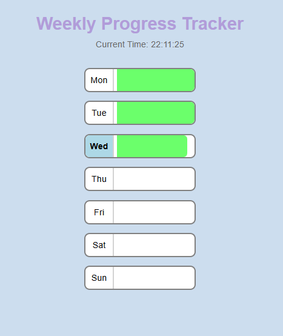

**Weekly Progress Tracker**

A React application that visualizes the progress of the current week using a vertical bar layout. Each day (Mon–Sun) is color-coded based on the current hour and filled proportionally to show progress through the day.

---

**Features**

⏱ Live updating clock with seconds

📅 7-day view: Mon to Sun

🎨 Color-coded progress bars by time of day:

Red: 00:00 – 06:59

Yellow: 07:00 – 12:59

Orange: 13:00 – 18:59

Green: 19:00 – 23:59

📈 Each day’s bar fills based on the current hour

---

---

**Acknowledgement** 
[Scrimba](http://scrimba.com)